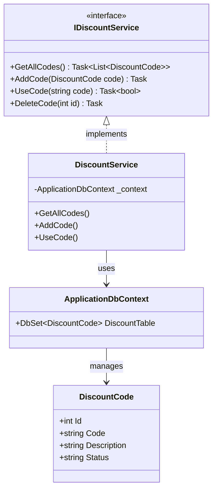

# 🏷️ DiscountApp – System Zarządzania Kodami Rabatowymi

## 0. Informacje Ogólne
**DiscountApp** to aplikacja webowa zbudowana w technologii **ASP.NET Core Razor Pages**. System służy do kompleksowego zarządzania cyklem życia kodów rabatowych: od ich generowania, przez monitorowanie, aż po bezpieczną weryfikację i jednorazową realizację.

Aplikacja zapewnia spójność danych dzięki wykorzystaniu bazy PostgreSQL i zapobiega wielokrotnemu użyciu tego samego kodu poprzez mechanizm zmiany stanu (**Status Pattern**).

---

## 1. Technologia (Stack)
Projekt został zrealizowany z wykorzystaniem nowoczesnych narzędzi programistycznych:

| Komponent | Technologia |
| :--- | :--- |
| **Język / Framework** | C# 13 / .NET 9 |
| **Baza Danych** | PostgreSQL |
| **ORM** | Entity Framework Core |
| **Interfejs** | HTML5 + Tailwind CSS |
| **Konteneryzacja** | Docker & Docker Desktop |
| **IDE** | JetBrains Rider |

---

## 2. Architektura i Wzorce
Mimo edukacyjnego charakteru projektu, zaimplementowano w nim wzorce klasy Enterprise:

* **Dependency Injection (DI):** Wykorzystanie wbudowanego kontenera .NET do wstrzykiwania serwisu `IDiscountService`.
* **Service Pattern:** Logika biznesowa została wyizolowana od warstwy prezentacji i zamknięta w dedykowanym serwisie.
* **Repository Pattern:** Wykorzystanie `ApplicationDbContext` do abstrakcji operacji na bazie danych.
* **Security:** Ochrona przed atakami CSRF przy użyciu **Antiforgery Tokens**.
 

## 2.1. Model Danych i Relacji (UML)

Poniższy schemat przedstawia architekturę klas oraz przepływ danych w aplikacji. Logika biznesowa jest odseparowana od warstwy prezentacji (Razor Pages) poprzez interfejs serwisu.



---

## 3. Instrukcja uruchomienia

### Krok 1: Budowa i start (Docker)
W folderze głównym projektu (tam, gdzie znajduje się plik docker-compose.yml) wykonaj komendę:

```bash
docker-compose up --build
 ```

 ### Krok 2: Restart (opcjonalny)
 Użyj tych komend, jeśli chcesz całkowicie wyczyścić bazę danych i wymusić ponowne wykonanie skryptu `init.sql`
```bash
docker-compose down -v
docker-compose up --build
```

### Krok 3: Dostęp do aplikacji
* **Baza danych**: Host: `db` (wewn.) lub `localhost:5432` (zewn.).
* **User**: `root` | **Password**: `root` | **Database**: `DiscountDb`.

---

## 4. Funkcjonalności
✅ Zarządzanie: Dodawanie nowych kodów rabatowych z opisem.

✅ Lista kodów: Podgląd statusów (ACTIVE/USED) z dynamicznym kolorowaniem (Tailwind CSS).

✅ Realizacja: Moduł weryfikujący i blokujący ponowne użycie kodu.

✅ Usuwanie: Możliwość zarządzania retencją danych z poziomu UI.

---

## Słowa końcowe

Na co dzień programuję w języku Java. Projekt DiscountApp jest moim pierwszym kontaktem z ekosystemem .NET oraz Entity Framework Core. Wyzwanie pozwoliło mi na porównanie mechanizmów wstrzykiwania zależności oraz pracy z bazą danych (Spring Data vs EF Core) w obu tych środowiskach.

`Projekt zrealizowany w ramach przedmiotu Programowanie Obiektowe`
